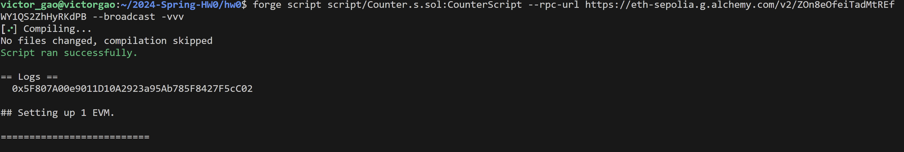

# 2024-Spring-HW0

All the detailed specified in Homework 0 documentation.

## Wallet Address
Please provide your MetaMask wallet address:
0x116d8ea154d98c6012e8f9cec7a2c35fc5213fcdbedc78d7764cbcf8966c4b7d

## Local Testing
Please provide a screenshot of the `forge test -vvv` command running in your local environment.

## Contract Address
Please provide the contract address that you deployed on the Sepolia network.

## Sepolia Etherscan
Paste the contract address into the Sepolia Etherscan and share the screenshot.

